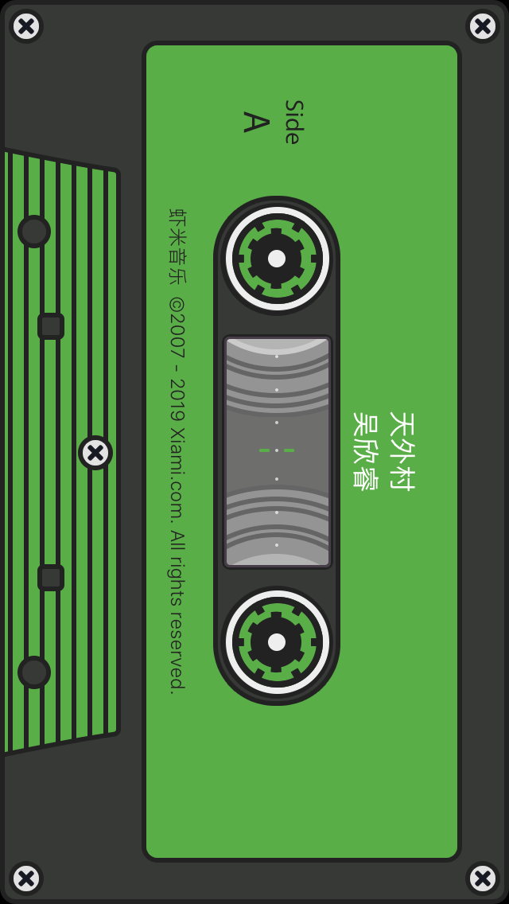

# Group Project

## Music Player(temporary name)

The idea of Cassette Music Player(temp) coming from a music player used that turn into a cassette UI whenever rotate into the landscape.

(a screenshot of the UI)

This application is to simulate the experience of using a cassette player. Later the idea was further extended to adding a file exchanger to simulate the experience of exchanging music cassette back in the time of the cassette player age.

The application is divided into three parts: UI, music player and file exchanger. UI should be designed and implemented based on the actual cassette player. The music player will be implemented to reflect the functions presented in the UI. The file exchanger will be implemented with a Web server, using a Web to exchange music files between the two devices involved.

The project is conducted in three stages: First, each member took one of the components and started basic research and implementation. Second, all components should be merged to test the overall functionality and consistency. Last stage, the UI of the whole application will be modified and present a consistent feeling.

## Schedule
The project will use two weeks as a sprint, each week, every member should report his work to other members.
### Sprint 1
Basic structure 
UI prototype 
HTTP server basics
### Sprint 2
Merging codes 
Testing 
### Sprint 3
Coherence Improvement 
UI finalization